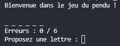
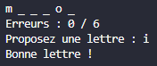
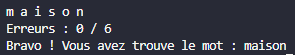
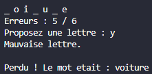

# Jeu du Pendu en C#

Un jeu du pendu classique jouable dans la console, developpe en C# avec .NET.

## Description

Le but du jeu est de deviner un mot cache lettre par lettre. Chaque mauvaise lettre compte comme une erreur. Le joueur a droit a 6 erreurs maximum avant de perdre la partie.

## Prerequis

- .NET SDK 10 (ou superieur) installe sur ta machine
- Un terminal (Terminal macOS, ou terminal integre de VS Code)
- Optionnel : Visual Studio Code avec l'extension C# Dev Kit pour l'edition

Pour verifier que .NET est installe, tape dans le terminal :

```
dotnet --version
```

## Structure du projet

```
pendu_csharp/
├── Pendu.csproj        Fichier de configuration du projet .NET
├── Program.cs          Point d'entree du programme
├── README.md           Ce fichier
└── src/
    ├── Mots.cs         Liste des mots et tirage aleatoire
    ├── Affichage.cs    Affichage console (mot + erreurs)
    └── Jeu.cs          Logique de la partie
```

### Role de chaque fichier

- **Program.cs** : demarre le programme, cree une partie et la lance.
- **src/Mots.cs** : contient la liste des mots et choisit un mot au hasard.
- **src/Affichage.cs** : affiche le mot en cours et le nombre d'erreurs.
- **src/Jeu.cs** : gere la boucle de jeu et la saisie des lettres.

## Lancer le jeu

Dans un terminal, depuis le dossier du projet :

```
cd pendu_csharp
dotnet run
```

## Regles du jeu

- Un mot est tire au hasard au demarrage.
- A chaque tour, le joueur propose une lettre.
- Si la lettre est dans le mot, elle s'affiche a sa place.
- Sinon, une erreur est ajoutee au compteur.
- 6 erreurs = defaite.
- Toutes les lettres trouvees = victoire.

## Exemple de partie

Voici a quoi ressemble une partie dans la console :





A la fin, le programme affiche soit :



soit :



## Auteur

**Sami El Abdallaoui**, **Sriram MALLIPOUDY**